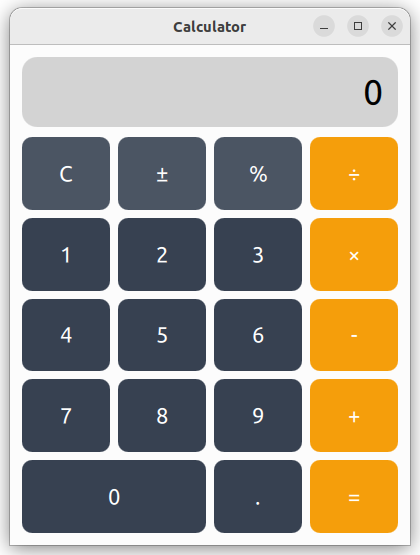
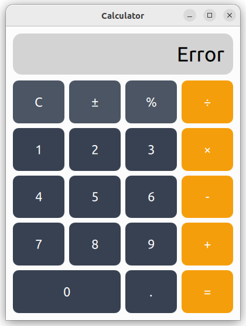

# 🧮 Qt QML Calculator

A clean and modern **Calculator** built with **Qt Quick (QML)** and **C++**,
featuring a responsive UI and keyboard support.

---

## 📸 Screenshots



### Divide by zero error:



---

## ✨ Features

- ✅ Basic arithmetic : Addition, Subtraction, Multiplication, Division
- ✅ Decimal point input with duplicate prevention
- ✅ Delete last digit ( Backspace )
- ✅ Full clear ( C key / Escape / Delete )
- ✅ Division by zero error handling
- ✅ Full keyboard support ( numpad included )
- ✅ Visual press feedback on buttons
- ✅ Clean result formatting ( no trailing zeros )

---

## 🛠 Tech Stack

| Layer       | Technology              |
| ----------- | ----------------------- |
| UI          | QML ( Qt Quick )        |
| Logic       | C++                     |
| Integration | Q_PROPERTY, Q_INVOKABLE |
| Build       | qmake                   |

---

## 🏗 Architecture

The app is split into two clear layers:

- **QML** handles the UI, button layout, and keyboard input
- **C++** handles all calculator logic and state

```
+-----------------------------------------------+
|                  QML Frontend                 |
|                                               |
|   Main.qml                                    |
|    |-- Display Rectangle                      |
|    |     shows calculator.displayText         |
|    |                                          |
|    |-- GridLayout (4 columns)                 |
|    |     CalcButton x19                       |
|    |     each calls calculator.pressButton()  |
|    |                                          |
|    +-- Item (keyboard listener)               |
|          maps keys to pressButton()           |
+------------------------+----------------------+
                         |
              Q_PROPERTY | Q_INVOKABLE
                         |
+------------------------+----------------------+
|                  C++ Backend                  |
|                                               |
|   Calculator.cpp                              |
|    |-- pressButton(label)                     |
|    |     handles: C, DEL, =, operators,       |
|    |              digits, decimal             |
|    |                                          |
|    |-- evaluate()                             |
|    |     computes result from                 |
|    |     operand1, operator, operand2         |
|    |                                          |
|    +-- emit displayTextChanged()              |
|          triggers QML to refresh display      |
+-----------------------------------------------+
```

---

## 🔢 Button Layout

```
+-------+-------+-------+-------+
|   C   |   ±   |   %   |   ÷   |
+-------+-------+-------+-------+
|   7   |   8   |   9   |   ×   |
+-------+-------+-------+-------+
|   4   |   5   |   6   |   -   |
+-------+-------+-------+-------+
|   1   |   2   |   3   |   +   |
+-------+-------+-------+-------+
|       0       |   .   |   =   |
+---------------+-------+-------+
```

### Button Colors

| Color         | Buttons             |
| ------------- | ------------------- |
| Amber #f59e0b | `+` `-` `×` `÷` `=` |
| Dark  #4b5563 | `C` `±` `%`         |
| Gray  #374151 | `0-9` `.`           |

---

## ⌨️ Keyboard Mapping

| Key                | Action        |
| ------------------ | ------------- |
| `0` - `9`          | Digit input   |
| `.`                | Decimal point |
| `+` `-` `*` `/`    | Operators     |
| `Enter` / `=`      | Evaluate      |
| `Backspace`        | Delete digit  |
| `Escape` /`Delete` | Clear all     |

---

## 📁 File Structure

```
QtCalculator/
|
+-- main.cpp          <- Entry point, registers calculator to QML
+-- Calculator.h      <- Class declaration
+-- Calculator.cpp    <- All calculator logic
|
+-- qml/
    +-- Main.qml        <- Window, display, grid, keyboard handler
    +-- CalcButton.qml  <- Reusable button component
```

---

## 🚀 Build and Run

```bash
git clone https://github.com/yourusername/QtCalculator.git
cd QtCalculator
mkdir build && cd build
qmake ..
make -j$(nproc)
./QtCalculator
```

---

## 🐛 Edge Cases Handled

| Situation              | Behavior                          |
| ---------------------- | --------------------------------- |
| Division by zero       | Display shows "Error"             |
| Double decimal point   | Second dot is ignored             |
| Backspace on one digit | Resets display to "0"             |
| Trailing zeros         | Removed from result automatically |

---

