# 📡 WiFi & Bluetooth Manager

A **Qt/QML** desktop application for managing WiFi networks and Bluetooth devices
on Linux, built using **D-Bus** to communicate directly with
**NetworkManager** and **BlueZ** system daemons.

---

## 📸 View App

### Drive link for app video

https://drive.google.com/file/d/1d_XP0D7jw076p35UshRCZJJdvdGLjqGO/view?usp=sharing

### Main Interface
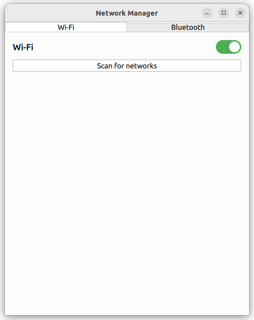

### WiFi Page
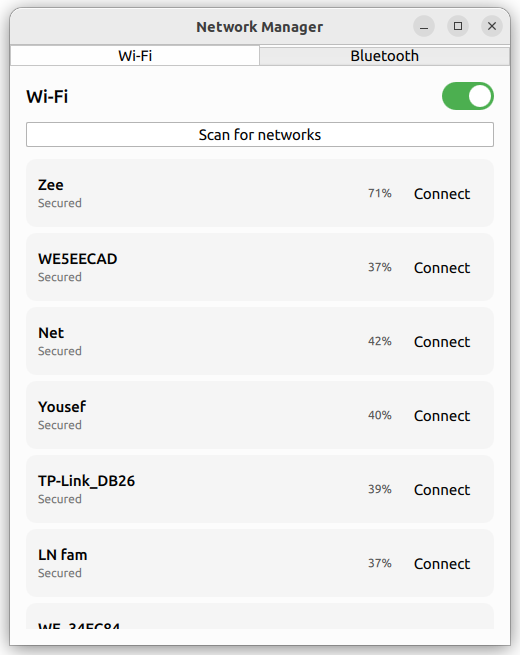

### Bluetooth Page
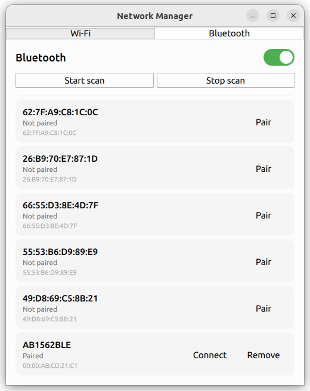

### Password Dialog
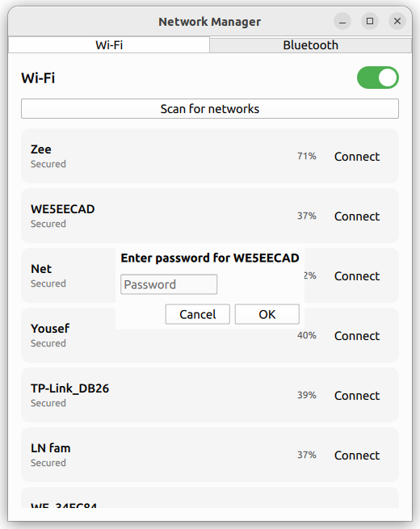

### Synced with Ubunto Network app

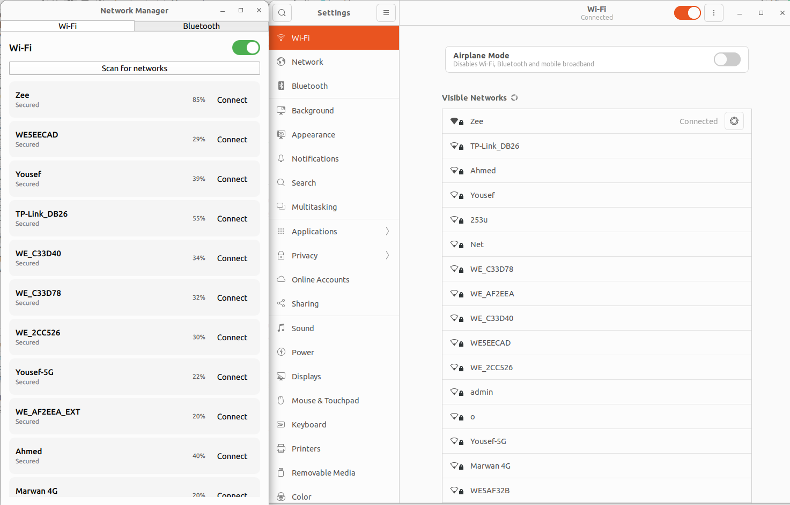

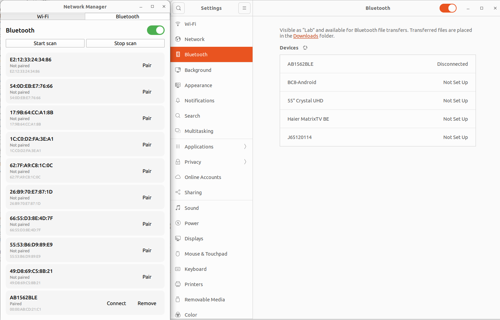

#### disabled and enabled from any app 

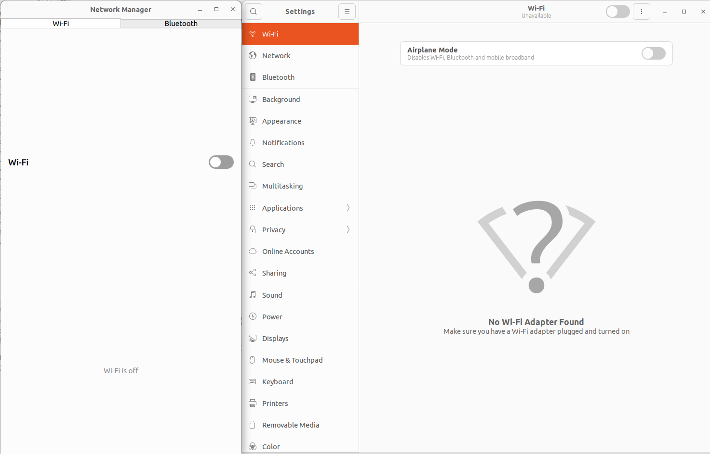

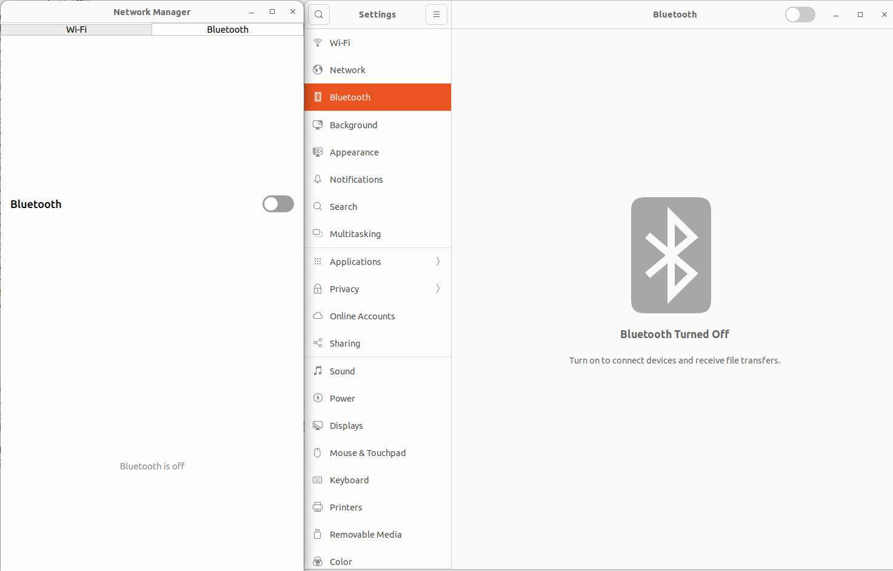


---

## 📋 Table of Contents

- [Features](#-features)
- [Tech Stack](#-tech-stack)
- [Project Architecture](#-project-architecture)
- [Understanding D-Bus](#-understanding-d-bus)
- [How WiFi Works in This App](#-how-wifi-works-in-this-app)
- [How Bluetooth Works in This App](#-how-bluetooth-works-in-this-app)
- [File Structure](#-file-structure)
- [Requirements](#-requirements)
- [Build & Run](#-build--run)
- [Known Issues & Fixes](#-known-issues--fixes)

---

## ✨ Features

### WiFi
- ✅ Enable / Disable WiFi via toggle switch
- ✅ Scan for nearby networks
- ✅ Display network list with signal strength
- ✅ Connect to open and secured (WPA/WPA2) networks
- ✅ Password dialog for secured networks
- ✅ Disconnect from current network
- ✅ Forget saved networks

### Bluetooth
- ✅ Enable / Disable Bluetooth via toggle switch
- ✅ Scan / Discover nearby devices
- ✅ Pair with devices
- ✅ Connect / Disconnect devices
- ✅ Remove paired devices
- ✅ Real-time device list updates via D-Bus signals

---

## 🛠 Tech Stack

| Layer                | Technology               |
| -------------------- | ------------------------ |
| UI                   | QML (Qt Quick 2.15)      |
| Backend              | C++ (Qt 5/6)             |
| System Communication | D-Bus (QtDBus)           |
| WiFi Management      | NetworkManager via D-Bus |
| Bluetooth Management | BlueZ via D-Bus          |
| Data Models          | QAbstractListModel       |

---

## 🏗 Project Architecture

### Full System Overview

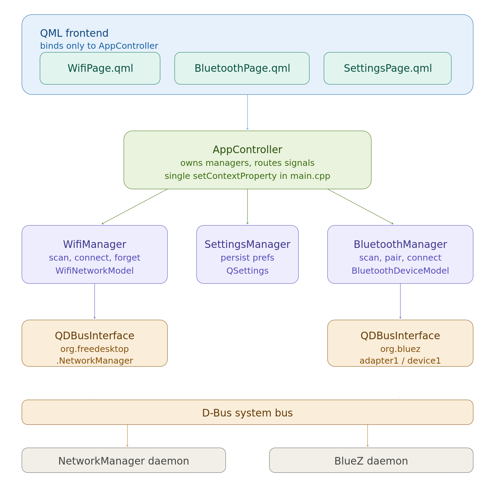


### WifiManager Internal Structure

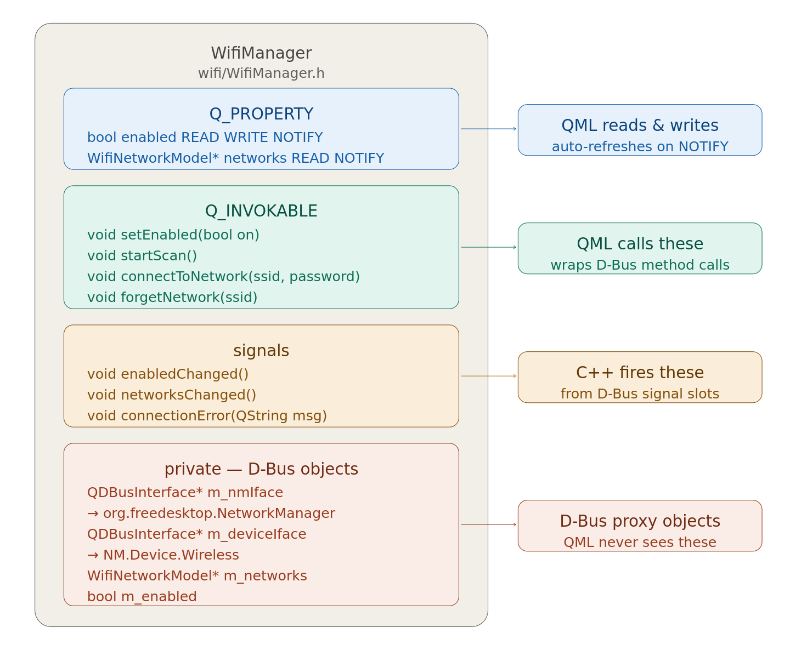

### BluetoothManager Internal Structure

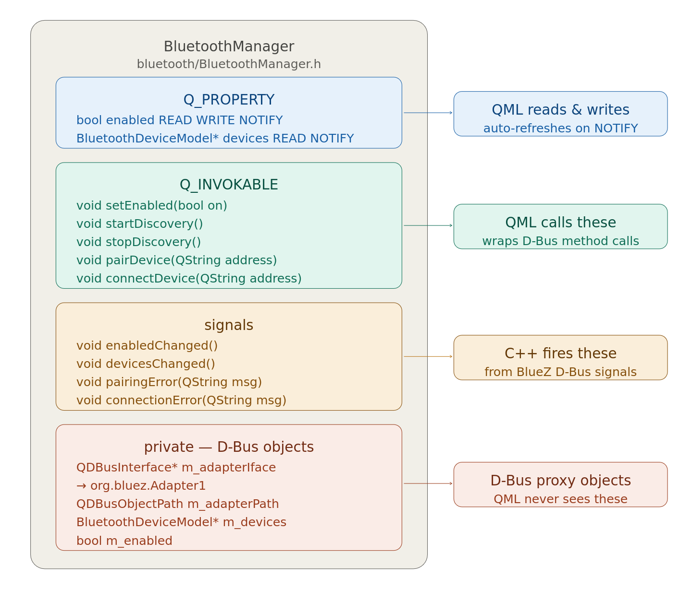

---

## 🔌 Understanding D-Bus

D-Bus is the **messaging system** that allows different programs on Linux
to talk to each other. This app uses it to communicate with
**NetworkManager** (WiFi) and **BlueZ** (Bluetooth) without needing
to directly control hardware.

### D-Bus as a Post Office

```
+=====================================================================+
|                          LINUX SYSTEM                               |
+=====================================================================+
|                                                                     |
|   +-------------+       +-------------+       +-------------+      |
|   |  Your App   |       |  Another    |       |   System    |      |
|   |  (Qt/QML)   |       |    App      |       |    Tool     |      |
|   +------+------+       +------+------+       +------+------+      |
|          |                     |                     |             |
|          |                     |                     |             |
|  ========+=====================+===================++==========    |
|          |                     |                     |             |
|          v                     v                     v             |
|   +======================================================+         |
|   |                  D-Bus System Bus                    |         |
|   |            (Central Messaging Highway)               |         |
|   +======================================================+         |
|             |                               |                      |
|             v                               v                      |
|   +--------------------+       +-----------------------+           |
|   | NetworkManager     |       | BlueZ Daemon          |           |
|   | Daemon             |       |                       |           |
|   | Manages WiFi       |       | Manages Bluetooth     |           |
|   | Manages Ethernet   |       | Manages BT Devices    |           |
|   +--------------------+       +-----------------------+           |
|                                                                     |
+=====================================================================+
```


### D-Bus Core Concepts

```
╔══════════════════════════════════════════════════════════════════════════╗
║                    D-Bus Concepts (Like a Building)                      ║
╠══════════════════════════════════════════════════════════════════════════╣
║                                                                          ║
║   SERVICE  = The Building Name                                           ║
║   ┌──────────────────────────────────────────┐                           ║
║   │  "org.freedesktop.NetworkManager"        │                           ║
║   │  "org.bluez"                             │                           ║
║   └──────────────────────────────────────────┘                           ║
║                          │                                               ║
║                          ▼                                               ║
║   OBJECT PATH  = The Room Number                                         ║
║   ┌──────────────────────────────────────────┐                           ║
║   │  "/org/freedesktop/NetworkManager"       │ ← Main office             ║
║   │  "/org/freedesktop/NetworkManager/       │                           ║
║   │                        Devices/3"        │ ← WiFi device room        ║
║   │  "/org/bluez/hci0"                       │ ← BT adapter room         ║
║   └──────────────────────────────────────────┘                           ║
║                          │                                               ║
║                          ▼                                               ║
║   INTERFACE  = The Department in that Room                               ║
║   ┌──────────────────────────────────────────┐                           ║
║   │  "org.freedesktop.NetworkManager.        │                           ║
║   │                    Device.Wireless"      │ ← WiFi department         ║
║   │  "org.bluez.Adapter1"                    │ ← BT adapter dept         ║
║   │  "org.freedesktop.DBus.Properties"       │ ← Properties dept         ║
║   └──────────────────────────────────────────┘                           ║
║                          │                                               ║
║          ┌───────────────┼────────────────┐                              ║
║          ▼               ▼                ▼                              ║
║       METHODS        SIGNALS          PROPERTIES                         ║
║    = Request Form  = Newsletter     = Info Board                         ║
║   ┌──────────┐    ┌──────────┐     ┌──────────┐                         ║
║   │ You call │    │ Daemon   │     │ Read or  │                         ║
║   │ these    │    │ fires    │     │ Write    │                         ║
║   │          │    │ these    │     │ values   │                         ║
║   │RequestScan    │ on event │     │          │                         ║
║   │GetDevices│    │          │     │ Enabled  │                         ║
║   │Connect   │    │AccessPoint     │ Strength │                         ║
║   └──────────┘    └──────────┘     └──────────┘                         ║
╚══════════════════════════════════════════════════════════════════════════╝


```


### Method vs Signal vs Property

```
╔══════════════════════════════════════════════════════════════════════════╗
║                    D-Bus Communication Types                             ║
╠═══════════════════════╦══════════════════════╦═══════════════════════════╣
║      METHOD           ║       SIGNAL         ║       PROPERTY            ║
╠═══════════════════════╬══════════════════════╬═══════════════════════════╣
║                       ║                      ║                           ║
║  You ──call──► Daemon ║ Daemon ──fire──► You ║ You ──read/write──►Daemon ║
║                       ║                      ║                           ║
║  Like asking a        ║  Like subscribing    ║  Like reading a           ║
║  question             ║  to a newsletter     ║  notice board             ║
║                       ║                      ║                           ║
║  EXAMPLES:            ║  EXAMPLES:           ║  EXAMPLES:                ║
║  RequestScan()  ✓     ║  AccessPointAdded ✓  ║  Strength        ✓        ║
║  GetDevices()   ✓     ║  InterfacesAdded  ✓  ║  WirelessEnabled ✓        ║
║  StartDiscovery ✓     ║  PropertiesChanged✓  ║  Powered         ✓        ║
║                       ║                      ║                           ║
║  ScanDone()     ✗     ║  ScanDone         ✗  ║                           ║
║  (doesn't exist!)     ║  (doesn't exist!)    ║                           ║
╚═══════════════════════╩══════════════════════╩═══════════════════════════╝
```


---

## 📶 How WiFi Works in This App

### WiFi Scan Flow

```
╔══════════════════════════════════════════════════════════════════════════╗
║                    WiFi D-Bus Communication Flow                         ║
╠══════════════════════════════════════════════════════════════════════════╣
║                                                                          ║
║  ① Setup (initDBus)                                                      ║
║  ┌──────────────────────────────┐                                        ║
║  │ QDBusInterface *m_nmIface   │──── connects to ──►org.freedesktop     ║
║  │                             │                   .NetworkManager       ║
║  │ QDBusInterface *m_deviceIface──── connects to ──►Devices/3           ║
║  └──────────────────────────────┘                   Device.Wireless      ║
║                                                                          ║
║  ② Toggle WiFi (setEnabled)                                              ║
║  ┌─────────────────┐                                                     ║
║  │ setEnabled(true)│                                                     ║
║  │                 │  Set("WirelessEnabled", true) ──► Sets property    ║
║  │ nmProps.call()  │◄── OK ──────────────────────── emits signal        ║
║  │                 │                                                     ║
║  │  emit           │◄── PropertiesChanged signal ─── WirelessEnabled    ║
║  │  enabledChanged │                                  changed            ║
║  └─────────────────┘                                                     ║
║                                                                          ║
║  ③ Scan WiFi (startScan)                                                 ║
║  ┌────────────────────────────────────────────────────────────────────┐ ║
║  │                                                                    │ ║
║  │  startScan()                                                       │ ║
║  │       │                                                            │ ║
║  │       │  call("RequestScan") ─────────────────────────────────►   │ ║
║  │       │◄── Reply type 2 (success) ─────────────────────────────   │ ║
║  │       │                              NM scans WiFi in background   │ ║
║  │  QTimer::singleShot(2000ms) ⏱️                                     │ ║
║  │       │                                                            │ ║
║  │       │ 2 seconds later...                                         │ ║
║  │       ▼                                                            │ ║
║  │  refreshNetworks()                                                 │ ║
║  │       │                                                            │ ║
║  │       │  call("GetAllAccessPoints") ──────────────────────────►   │ ║
║  │       │◄── [path1, path2, path3...] ──────────────────────────    │ ║
║  │       │                                                            │ ║
║  │       │  For each path:                                            │ ║
║  │       │    apIface.property("Ssid")      ──────────────────────►  │ ║
║  │       │    apIface.property("Strength")  ──────────────────────►  │ ║
║  │       │    apIface.property("RsnFlags")  ──────────────────────►  │ ║
║  │       │                                                            │ ║
║  │  m_networks->setNetworks(list)                                     │ ║
║  │  emit networksChanged() ─────────────────────────────► QML updates │ ║
║  └────────────────────────────────────────────────────────────────────┘ ║
╚══════════════════════════════════════════════════════════════════════════╝
```
### ⚠️ Important Bug Fix: ScanDone Signal Does Not Exist

A key discovery during development was that `ScanDone` is **not** a real
NetworkManager D-Bus signal. This is why the original scan code never
showed any networks.

```
╔══════════════════════════════════════════════════════════════════════════╗
║              ❌ ORIGINAL CODE (BROKEN)                                   ║
╠══════════════════════════════════════════════════════════════════════════╣
║                                                                          ║
║   startScan()                                                            ║
║       │                                                                  ║
║       │  call RequestScan ──────────────────────────────►               ║
║       │◄── OK                                                            ║
║       │                                                                  ║
║       │  waiting for "ScanDone" signal...                               ║
║       │  ⏳ FOREVER                                                      ║
║       │                                                                  ║
║       │  ╔══════════════════════════════════════╗                        ║
║       │  ║  "ScanDone" does NOT exist in the   ║                        ║
║       │  ║   NetworkManager D-Bus API!          ║                        ║
║       │  ╚══════════════════════════════════════╝                        ║
║       │                                                                  ║
║   onScanDone()      → NEVER CALLED ✗                                    ║
║   refreshNetworks() → NEVER CALLED ✗                                    ║
║   ListView          → ALWAYS EMPTY ✗                                    ║
║                                                                          ║
╠══════════════════════════════════════════════════════════════════════════╣
║              ✅ FIXED CODE (WORKING)                                     ║
╠══════════════════════════════════════════════════════════════════════════╣
║                                                                          ║
║   startScan()                                                            ║
║       │                                                                  ║
║       │  call RequestScan ──────────────────────────────►               ║
║       │◄── Reply type 2 (success)                                        ║
║       │                                                                  ║
║       │  QTimer::singleShot(2000ms) ⏱️                                   ║
║       │  (2 seconds is enough for NM to finish scanning)                ║
║       │                                                                  ║
║       ▼  2 seconds later...                                              ║
║   refreshNetworks()  → CALLED ✓                                          ║
║   GetAllAccessPoints → returns results ✓                                 ║
║   ListView           → shows networks ✓                                  ║
║                                                                          ║
╚══════════════════════════════════════════════════════════════════════════╝
```


---

## 🦷 How Bluetooth Works in This App

### BlueZ GetManagedObjects Data Structure

BlueZ exposes all its objects (adapters and devices) through a single
`GetManagedObjects` call. The response is a deeply nested D-Bus structure:

```
╔══════════════════════════════════════════════════════════════════════════╗
║         BlueZ GetManagedObjects Response Structure                       ║
║         D-Bus Signature: a{oa{sa{sv}}}                                   ║
╠══════════════════════════════════════════════════════════════════════════╣
║                                                                          ║
║  Level 1: Map < ObjectPath → Interfaces >                               ║
║  │                                                                       ║
║  ├── "/org/bluez"                                                        ║
║  │       └── Level 2: Map < InterfaceName → Properties >               ║
║  │               └── "org.freedesktop.DBus.Introspectable" → { }       ║
║  │                                                                       ║
║  ├── "/org/bluez/hci0"              ◄── ADAPTER                         ║
║  │       └── Level 2: Map < InterfaceName → Properties >               ║
║  │               │                                                       ║
║  │               ├── "org.bluez.Adapter1"  ◄── WE LOOK FOR THIS        ║
║  │               │       └── Level 3: Map < PropName → Variant >        ║
║  │               │               ├── "Powered"      → true              ║
║  │               │               ├── "Discoverable" → false             ║
║  │               │               └── "Address"      → "AA:BB:CC:..."   ║
║  │               │                                                       ║
║  │               └── "org.freedesktop.DBus.Properties" → { }           ║
║  │                                                                       ║
║  └── "/org/bluez/hci0/dev_AA_BB_CC_DD_EE_FF"  ◄── DEVICE               ║
║          └── Level 2: Map < InterfaceName → Properties >               ║
║                  └── "org.bluez.Device1"  ◄── WE LOOK FOR THIS         ║
║                          └── Level 3: Map < PropName → Variant >        ║
║                                  ├── "Name"      → "My Headphones"      ║
║                                  ├── "Address"   → "AA:BB:CC:DD:EE:FF" ║
║                                  ├── "Paired"    → true                 ║
║                                  ├── "Connected" → false                ║
║                                  └── "Class"     → 2360344              ║
╚══════════════════════════════════════════════════════════════════════════╝
```
### Bluetooth Communication Flow

```
╔══════════════════════════════════════════════════════════════════════════╗
║                  Bluetooth D-Bus Communication Flow                      ║
╠══════════════════════════════════════════════════════════════════════════╣
║                                                                          ║
║  ① Initialization                                                        ║
║  ┌────────────────────────────────────────────────────────────────────┐ ║
║  │  initDBus()                                                        │ ║
║  │       │                                                            │ ║
║  │       │  findAdapter()                                             │ ║
║  │       │       │ GetManagedObjects() ──────────────────────────►   │ ║
║  │       │       │◄─── All BlueZ objects ─────────────────────────   │ ║
║  │       │       │                                                    │ ║
║  │       │       │ Parse objects:                                     │ ║
║  │       │       │   found "org.bluez.Adapter1"                       │ ║
║  │       │       │   at "/org/bluez/hci0"              ✓              │ ║
║  │       │                                                            │ ║
║  │       │  Create m_adapterIface ────────────────────────────────►  │ ║
║  │       │  Subscribe to signals:                                     │ ║
║  │       │    InterfacesAdded   ───────────────────────────────────►  │ ║
║  │       │    InterfacesRemoved ───────────────────────────────────►  │ ║
║  │       │    PropertiesChanged ───────────────────────────────────►  │ ║
║  └────────────────────────────────────────────────────────────────────┘ ║
║                                                                          ║
║  ② Toggle Bluetooth (setEnabled)                                         ║
║  ┌────────────────────────────────────────────────────────────────────┐ ║
║  │  setEnabled(true)                                                  │ ║
║  │       │  Set("Powered", true) ────────────────────────────────►   │ ║
║  │       │◄── OK ─────────────────────────────────────────────────   │ ║
║  │       │◄── PropertiesChanged("Powered": true) ─────────────────   │ ║
║  │       │    emit enabledChanged() ────────────────────────────────► │ ║
║  │       │                                              QML updates  │ ║
║  └────────────────────────────────────────────────────────────────────┘ ║
║                                                                          ║
║  ③ Scan / Discovery                                                      ║
║  ┌────────────────────────────────────────────────────────────────────┐ ║
║  │  startDiscovery()                                                  │ ║
║  │       │  call("StartDiscovery") ──────────────────────────────►   │ ║
║  │       │◄── OK ─────────────────────────────────────────────────   │ ║
║  │       │                           BlueZ scans in background...    │ ║
║  │       │                                                            │ ║
║  │       │◄── InterfacesAdded(path, interfaces) ──────────────────   │ ║
║  │       │     (fired automatically for each device found)           │ ║
║  │       │                                                            │ ║
║  │  onInterfacesAdded()                                               │ ║
║  │       │   Parse device properties                                  │ ║
║  │       │   addOrUpdateDevice(dev)                                   │ ║
║  │       │   emit devicesChanged() ─────────────────────────────►    │ ║
║  │       │                                              QML updates  │ ║
║  └────────────────────────────────────────────────────────────────────┘ ║
╚══════════════════════════════════════════════════════════════════════════╝
```
### QDBusArgument Parsing the Nested Structure

```
╔══════════════════════════════════════════════════════════════════════════╗
║                    QDBusArgument Parsing Flow                            ║
╠══════════════════════════════════════════════════════════════════════════╣
║                                                                          ║
║  arg.beginMap();            ← Open Level 1 (ObjectPath map)             ║
║  │                                                                       ║
║  while (!arg.atEnd()) {                                                  ║
║  │                                                                       ║
║  │   arg.beginMapEntry();   ← Start one ObjectPath entry                ║
║  │   │   arg >> objectPath; ← Read the ObjectPath key                   ║
║  │   │                        e.g. "/org/bluez/hci0"                    ║
║  │   │                                                                   ║
║  │   │   arg.beginMap();    ← Open Level 2 (Interface map)              ║
║  │   │   │                                                               ║
║  │   │   while (!arg.atEnd()) {                                          ║
║  │   │   │   arg.beginMapEntry();                                        ║
║  │   │   │   │  arg >> interfaceName; ← e.g. "org.bluez.Adapter1"      ║
║  │   │   │   │                                                           ║
║  │   │   │   │  arg.beginMap();  ← Open Level 3 (Properties map)       ║
║  │   │   │   │  │                                                        ║
║  │   │   │   │  while (!arg.atEnd()) {                                   ║
║  │   │   │   │  │   arg.beginMapEntry();                                 ║
║  │   │   │   │  │   │  arg >> propertyName;  ← e.g. "Powered"          ║
║  │   │   │   │  │   │  arg >> propertyValue; ← QDBusVariant(true)      ║
║  │   │   │   │  │   arg.endMapEntry();                                   ║
║  │   │   │   │  │   props[propertyName] = propertyValue.variant()       ║
║  │   │   │   │  }                                                        ║
║  │   │   │   │  arg.endMap(); ← Close Level 3                           ║
║  │   │   │   │                                                           ║
║  │   │   │   │  // CHECK: is this an adapter or device?                 ║
║  │   │   │   │  if (interfaceName == "org.bluez.Adapter1")              ║
║  │   │   │   │      adapterPath = objectPath  ← FOUND!                  ║
║  │   │   │   │                                                           ║
║  │   │   │   arg.endMapEntry();                                          ║
║  │   │   }                                                               ║
║  │   │   arg.endMap();    ← Close Level 2                               ║
║  │   arg.endMapEntry();   ← End ObjectPath entry                        ║
║  }                                                                       ║
║  arg.endMap();            ← Close Level 1                               ║
║                                                                          ║
╚══════════════════════════════════════════════════════════════════════════╝
```


---

## 📁 File Structure

```
WifiAndBluetoothManager/
│
├── main.cpp                        ← App entry, registers context
├── AppController.h/.cpp            ← Owns all managers
│
├── wifi/
│   ├── WifiManager.h               ← Q_PROPERTY, Q_INVOKABLE declarations
│   ├── WifiManager.cpp             ← D-Bus logic for NetworkManager
│   ├── WifiNetworkModel.h          ← QAbstractListModel header
│   └── WifiNetworkModel.cpp        ← Model roles: ssid, strength, etc.
│
├── bluetooth/
│   ├── BluetoothManager.h          ← Q_PROPERTY, Q_INVOKABLE declarations
│   ├── BluetoothManager.cpp        ← D-Bus logic for BlueZ
│   ├── BluetoothDeviceModel.h      ← QAbstractListModel header
│   └── BluetoothDeviceModel.cpp    ← Model roles: name, address, etc.
│
├── settings/
│   ├── SettingsManager.h
│   └── SettingsManager.cpp         ← QSettings (no D-Bus needed)
│
├── qml/
│   ├── main.qml                    ← Root window, navigation
│   ├── WifiPage.qml                ← WiFi UI page
│   ├── BluetoothPage.qml           ← Bluetooth UI page
│   ├── SettingsPage.qml            ← Settings UI page
│   ├── NetworkCard.qml             ← WiFi network list item
│   ├── DeviceCard.qml              ← Bluetooth device list item
│   └── ToggleSwitch.qml            ← Reusable toggle component
│
└── docs/
    └── screenshots/                ← GUI screenshots for README
        ├── main_screen.png
        ├── wifi_page.png
        ├── bluetooth_page.png
        └── password_dialog.png
```


---

## 📦 Requirements

| Requirement    | Version           |
| -------------- | ----------------- |
| Qt             | 5.15+ or 6.x      |
| QtDBus         | included with Qt  |
| NetworkManager | 1.0+              |
| BlueZ          | 5.0+              |
| Linux          | Any modern distro |

### Install Dependencies (Ubuntu/Debian)

```bash
# Qt development tools
sudo apt install qt5-default qtdeclarative5-dev

# Qt D-Bus module
sudo apt install libqt5dbus5

# NetworkManager (usually pre-installed)
sudo apt install network-manager

# BlueZ (usually pre-installed)
sudo apt install bluez
```

---

## 🚀 Build & Run

```bash
# Clone the repository
git clone https://github.com/yourusername/WifiAndBluetoothManager.git
cd WifiAndBluetoothManager

# Create build directory
mkdir build && cd build

# Configure and build
qmake ..
make -j$(nproc)

# Run the app
./WifiAndBluetoothManager
```

### Verify System Services Are Running

```bash
# Check NetworkManager
systemctl status NetworkManager

# Check BlueZ
systemctl status bluetooth

# If not running, start them
sudo systemctl start NetworkManager
sudo systemctl start bluetooth
```

### Useful D-Bus Debug Commands

```bash
# List all WiFi devices
dbus-send --system --print-reply \
  --dest=org.freedesktop.NetworkManager \
  /org/freedesktop/NetworkManager \
  org.freedesktop.NetworkManager.GetDevices

# Trigger a WiFi scan (replace Devices/3 with your device path)
dbus-send --system --print-reply \
  --dest=org.freedesktop.NetworkManager \
  /org/freedesktop/NetworkManager/Devices/3 \
  org.freedesktop.NetworkManager.Device.Wireless.RequestScan \
  dict:string:string:""

# List all BlueZ managed objects (adapters + devices)
dbus-send --system --print-reply \
  --dest=org.bluez / \
  org.freedesktop.DBus.ObjectManager.GetManagedObjects

# List Bluetooth adapters
bluetoothctl list

# Check if BlueZ is on D-Bus
busctl tree org.bluez
```

---

## 🐛 Known Issues & Fixes

### WiFi: Networks Never Appeared After Scan

**Cause:** The code was waiting for a `ScanDone` D-Bus signal that
**does not exist** in the NetworkManager API.

**Fix:** After calling `RequestScan`, use a `QTimer::singleShot(2000ms)`
to wait for the scan to complete, then manually call `GetAllAccessPoints`.

```cpp
// ❌ WRONG - ScanDone signal does not exist!
bus.connect(NM_SERVICE, m_devicePath, NM_DEV_WIFI,
            "ScanDone", this, SLOT(onScanDone()));

// ✅ CORRECT - Wait then fetch results manually
QTimer::singleShot(2000, this, &WifiManager::refreshNetworks);
```

### Bluetooth: "No Bluetooth adapter found via BlueZ"

**Cause:** The `QDBusReply` with complex nested map type
`QMap<QDBusObjectPath, QMap<QString, QVariantMap>>` fails silently
because the D-Bus type is not automatically registered.

**Fix:** Use raw `QDBusMessage` and manually parse the `QDBusArgument`
by iterating through the nested map structure level by level.

```cpp
// ❌ WRONG - Complex type not auto-registered, returns invalid silently
QDBusReply<QMap<QDBusObjectPath, QMap<QString, QVariantMap>>> reply =
    objMgr.call("GetManagedObjects");

// ✅ CORRECT - Use raw message and parse QDBusArgument manually
QDBusMessage msg = QDBusMessage::createMethodCall(
    BLUEZ_SERVICE, "/", DBUS_OBJMGR, "GetManagedObjects");
QDBusMessage response = bus.call(msg);
const QDBusArgument &arg =
    response.arguments().first().value<QDBusArgument>();
// Then iterate with arg.beginMap() / arg.endMap()
```

### Bluetooth: InterfacesAdded Signal Not Received

**Cause:** The signal carries `QMap<QString, QVariantMap>` which
needs to be registered as a D-Bus meta-type before it can be
received by a slot.

**Fix:** Register the type at startup using `qDBusRegisterMetaType`.

```cpp
typedef QMap<QString, QVariantMap> InterfacesMap;
Q_DECLARE_METATYPE(InterfacesMap)

// In initDBus() or constructor:
qDBusRegisterMetaType<InterfacesMap>();
```


---

## 🙏 Acknowledgements

- [NetworkManager D-Bus API Reference](https://networkmanager.dev/docs/api/latest/)
- [BlueZ D-Bus API Reference](https://git.kernel.org/pub/scm/bluetooth/bluez.git/tree/doc)
- [Qt D-Bus Documentation](https://doc.qt.io/qt-6/qtdbus-index.html)

